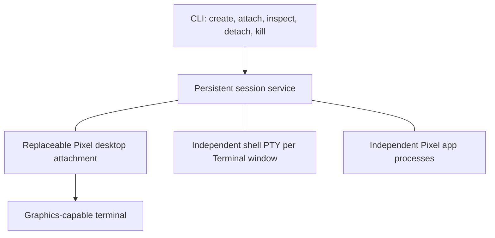

# Developing Zatara

Zatara is a persistent, mouse-first desktop for Pixel applications, rendered
inside a graphics-capable terminal. It combines floating windows and graphical
apps with independent shell processes and detachable sessions.

This document explains the architecture and its boundaries. [AGENTS.md](AGENTS.md)
records working preferences; [README.md](README.md) covers installation and use.
Implementation details below describe the current proof of concept, not promises
of production readiness or capabilities in every terminal.

## What the project is—and is not

Zatara owns a desktop, window lifecycle, application processes, and session
attachment. Pixel supplies graphics, UI primitives, and guest surfaces. Built-in
GUI apps use TypeScript/React with Pixel's native renderer. The desktop itself
does not require Chromium; the optional browser/editor integrations do.

GUI compatibility is **Pixel-only**. Supporting arbitrary X11, Wayland, native
macOS, or other non-Pixel GUI applications is an explicit non-goal. The shell
app supports ordinary terminal programs, but launching a graphical executable
inside its PTY does not turn that executable into a Zatara window.

Zatara is not:

- A general-purpose display server or an operating-system application sandbox.
- A multi-user remote desktop service exposed over the network.
- A guarantee of pixel graphics in every terminal.
- A replacement for durable application data storage or process checkpointing.
- A settled answer about the fastest architecture before alternatives have
  actually been measured.

The experience should remain beautiful, responsive, robust, and mouse-first.
Performance constraints justify measurement and careful resource ownership,
not automatically abandoning graphical quality.

## Process architecture



The diagram shows ownership/control relationships, not every data transfer.
GUI guests connect to the service's Pixel owner socket. The service retains
frames; the desktop reads them and composites the visible windows. PTY output
is parsed in the service and sent to the desktop as terminal cell snapshots.

| Component | Responsibility | Lifetime |
| --- | --- | --- |
| CLI (`src/cli.ts`) | Session commands and attachment startup | Command invocation |
| Session startup (`src/sessions.ts`) | Find/start services and enumerate sessions | CLI/app operation |
| Service (`src/server.ts`) | Authoritative geometry, processes, PTYs, guest connections, retained frames | Session |
| Desktop (`src/desktop.tsx`) | Compose windows, route input, draw icons/taskbar/menus | Attachment |
| Shell (`src/terminal.ts`) | PTY, xterm parser, scrollback, keyboard/mouse encoding | Window |
| Pixel guest | Application state and content rendering | Application window/process |

The service is authoritative. Desktop actions can update the local view
optimistically, but service state is the shared session state. One attachment
per session is the default; a second attachment is rejected rather than silently
stealing the first connection.

### Lifecycle guarantees

- **Minimize:** hides the window and preserves its application.
- **Close:** ends the window's shell or guest and removes its window state.
- **Detach / attachment crash / SSH disconnect:** preserves the service, app
  processes, shell state, guest connections, and current window geometry.
- **Explicit session termination:** ends the session and its owned windows.
- **Service crash or machine reboot:** recovery is not implemented.

Session persistence is process survival, not serialization to disk. Frame files
are presentation state, not application checkpoints. Some upstream tools have
shared services of their own—for example terminal-code's code-server—which can
outlive an individual window; see the README's integration notes.

A rebuilt executable does not replace code inside a running service or guest.
When diagnosing an upgrade, identify which processes are old. Reattaching loads
new desktop code; service-wide changes may require a fresh session. Do not
terminate a user's existing session just to simplify development.

Zatara's JSON session IPC currently has no explicit protocol-version negotiation.
An updated attachment is not guaranteed to understand every older service (or
vice versa). When their contracts disagree, use a fresh session for the updated
stack while leaving the old session available for existing work. Individual
compatibility adapters are not a general live-upgrade mechanism.

## Window and application contracts

Prefer the existing shared contracts over app-specific wiring:

- `src/model.ts`: window state, geometry, bounds, focus, and lifecycle actions.
- `src/window-frame.tsx`: shared decorations, gestures, resizing, and clipping.
- `src/primitives.tsx`: reusable desktop visual primitives.
- `src/app-window.tsx`: native app root, host setup, focus/resize context,
  appearance policy, and cleanup.
- `src/apps.ts`: built-in launchers and custom application registration.
- `src/protocol.ts`: typed IPC commands, replies, frames, and input validation.

Apps supply content and launch metadata; Zatara supplies their outer windows.
Custom registration describes ID, name, icon, command, and optional initial size.
It does not give each app its own lifecycle implementation. The current native
app helper is an internal project interface, not a separately published SDK.

Focus and visibility are independent. Several windows can be visible, while
only one receives keyboard input. Pointer hit testing must respect overlap and
translate desktop coordinates into the selected window's content coordinates.
Window movement, resize handles, title-bar controls, and content must agree on
where those boundaries are.

See [window contracts](docs/window-contracts.md) for API examples and compiler
contract tests.

## Rendering, scale, and input

### Two content paths

**Pixel guests:** each guest supplies a BGRA frame. The service copies that frame
before acknowledging it because the guest may immediately reuse its source
buffer. An atomic rename publishes a complete retained frame. The attachment
reads the frame and presents it through a clipped Pixel surface.

**Shells:** `@xterm/headless` parses output from `node-pty`. The attachment draws
cells at exact xterm column/row positions. Font shaping must not accumulate
horizontal drift relative to the cursor. Wide and combining characters need
correct cell occupancy, not guessed string lengths.

Guest alpha handling is isolated in `src/pixel-frame.ts`. The adapter composites
straight-alpha pixels onto the viewport background before surface upload. It is
version-sensitive and should be rechecked when Pixel changes.

### Coordinate systems

The UI uses logical units; service geometry and guest frame buffers use physical
pixels. `src/pixel.ts` adapts native primitives and events, while `src/display.ts`
converts at the session boundary. Terminal-relative scale is derived from cell
height divided by 18, not from querying the local monitor's DPI.

`contentSize` is shared by the service and window frame so that decorations,
content dimensions, and PTY rows/columns agree. A maximized window occupies the
desktop above the taskbar. Resizes must keep windows reachable.

The shell viewport also handles snapshots larger than its current visible area:
it keeps the cursor row visible and translates pointer coordinates accordingly.
This covers frames in flight during resizing and older services with different
chrome geometry. It is a compatibility fallback, not a correction of an old
service's PTY dimensions; full-screen TUIs still need consistent service sizing.

See [display scaling](docs/display-scaling.md) for measurements and remaining
live-terminal verification boundaries.

### Shared editing behavior

Pixel text controls own editing and selection. Individual apps should not
reimplement Backspace, Shift+Arrow selection, copying, or selection replacement.
Zatara must preserve key identity and modifiers across its input transport.

Pixel 0.0.15 can emit `text: null` for non-text keys despite declaring
`text?: string`. `src/key-event.ts` normalizes this at the native boundary, and
IPC also accepts and normalizes null key text. Malformed text/paste payloads
remain errors. Types and runtime validation are complementary.

Shell editing is a separate path: key sequences go to the terminal application,
which determines their meaning. Pixel input-field behavior does not imply that
every shell or TUI implements the same editing shortcuts.

## Resource limits and performance tradeoffs

Current safeguards include:

- At most 24 windows per proof-of-concept session.
- One retained latest GUI frame per window, with obsolete notifications
  coalesced and guest frames acknowledged even when discarded.
- Frame notifications coalesced on a 16 ms timer; this is not a guaranteed
  display refresh rate or an always-running animation loop.
- Guest frames above 16 million pixels rejected by the service.
- Shell scrollback limited to 2,000 lines; PTY input to the parser is paused
  above 256 KiB pending and resumed below 64 KiB.
- IPC receive buffering capped at 4 MiB and slow socket writes disconnected
  above the 2 MiB pending threshold.

These are bounds on particular buffers, not a fixed process-tree memory budget.
Each guest has its own allocations. An unfocused/minimized guest may still
animate and consume CPU. Synchronous frame copies and whole-surface composition
are current costs; dirty-region transport and zero-copy rendering are not
implemented optimizations.

Disk retention is a separate constraint: session and per-app logs append without
rotation or size limits. Long-lived or noisy sessions can grow disk use even
when the output queues and retained frame count stay bounded. The limits above
must not be described as bounding all session storage.

Measure idle CPU, process-tree memory, frame timing, input-to-frame latency, and
transmitted bytes across idle, dragging, shell output, and web scrolling. Record
host, versions, viewport, workload, and method. Service frame receipt, compositor
frame receipt, terminal submission, and physical display latency are different
measurements. A single-process RSS sample is not a process-tree memory total.

The original preference for experiments remains: compare alternate approaches
with real numbers after establishing a working baseline.

## Trust, dependencies, and compatibility

This is a trusted, same-user desktop. Local Unix sockets, restrictive runtime
permissions, and IPC validation do not turn guest applications into sandboxed
code. Apps run with user privileges and inherit the service's environment.
Do not silently filter `HERDR_ENV` or similar markers to hide an ancestry issue;
trace how the persistent service acquired the environment instead.

The runtime directory is created with restrictive permissions when new. An
existing path supplied through `ZATARA_RUNTIME` is not chmod-enforced; its owner
must provide a private directory with appropriate permissions. Do not assume
an arbitrary existing shared directory has the default isolation properties.

Pixel is pinned to 0.0.15. Zatara uses private native React, host, and instance
entrypoints through documented adapters. `scripts/build.cjs` resolves those
entrypoints relative to Pixel's installed package so npm dependency hoisting
works. Review these boundaries on upgrades rather than editing installed
`node_modules` files ad hoc.

The xterm mouse adapter also uses a pinned internal API. The postinstall script
repairs node-pty's macOS spawn-helper executable bit. These are compatibility
obligations, not incidental code to remove without testing.

Browser and Code are optional real upstream integrations. Version compatibility
matters; successful process creation alone does not establish a working app.
Their adapters must report failures rather than substitute mock content.

## Platforms and future display backends

The original acceptance target is Ghostty on macOS. Linux packages exist for
Pixel, but Zatara's Linux graphical behavior needs explicit validation. A build
or headless test does not establish a working interactive Linux desktop.

Current SSH operation runs execution and rendering remotely, with terminal
graphics sent through SSH. The local client must support the graphics protocol.
Apple Terminal, a serial terminal, and a plain Linux text console do not acquire
pixel graphics simply because the server can render frames.

A **direct Linux DRM/KMS display host** is planned, not shipped. The intended
boundary reuses the Pixel desktop's frames and input interface while presenting
to Linux display hardware instead of terminal graphics. It requires display
ownership, keyboard/mouse integration, explicit scale/font metrics, VT switching,
and recovery testing. It does not expand the Pixel-only application scope.

For that experiment, a Proxmox VM's graphical noVNC display is a different target
from a container shell or serial/xterm.js console. A container console is not a
virtual monitor. A local-rendering network client is also deferred.

## Development and validation workflow

Use Node 22+ and npm. From the repository root:

```sh
npm ci
npm run check
npm test
npm start
```

`npm test` includes compiler checks, a build, and isolated integration tests.
`test/types/contracts.ts` uses negative compile examples to keep invalid API
usage invalid. The native harness in `scripts/harness.ts` exercises real app
processes and the compositor without taking over a user's running desktop.

Choose validation that addresses the changed boundary:

- Window changes: overlap, hit targets, drag/resize, maximize/restore, clipping.
- Input changes: real focus routing, exact selection/copy/replacement results.
- Service changes: detach and abrupt attachment death, state and PID survival.
- Rendering changes: native readback plus live terminal testing where needed.
- Resource changes: sustained output and bounded growth, not only quiet demos.
- Packaging changes: install the actual tarball outside the source tree, run
  the CLI, and launch/render apps with the installed dependency layout.

Optional real-app checks and benchmarks are listed in `package.json` and the
linked docs. They have additional dependencies; do not present them as covered
by the ordinary test suite. Keep visual evidence genuine and identify harness
captures as such.

## Packaging and releases

The current published unit is `@zatara-dev/desktop`, with the `zatara` executable.
It contains the desktop, service, Terminal, Pixel Studio, Session Manager, Task
Manager, and integration adapters. Built-in app processes are independent even
though they share one distribution package. Browser/editor upstream downloads
remain optional. Separate app and SDK packages have not been created.

The GitHub repository is public. Zatara is BSD-3-Clause, copyright Jagtesh Chadha;
third-party dependencies retain their own licenses. Keep package metadata,
installation examples, lockfile, and license consistent. Publish the tested
artifact and distinguish authentication/upload success from registry availability.

## Further reading

- [Implementation notes and Pixel adapters](docs/architecture.md)
- [Window, app, and IPC contracts](docs/window-contracts.md)
- [Display scaling and shell grid measurements](docs/display-scaling.md)
- [Appearance configuration](docs/configuration.md)
- [Session and task managers](docs/managers.md)
- [Earlier verification record](docs/verification.md)

Older verification records describe their own revisions and environments. They
are historical evidence, not automatic certification of subsequent changes.
