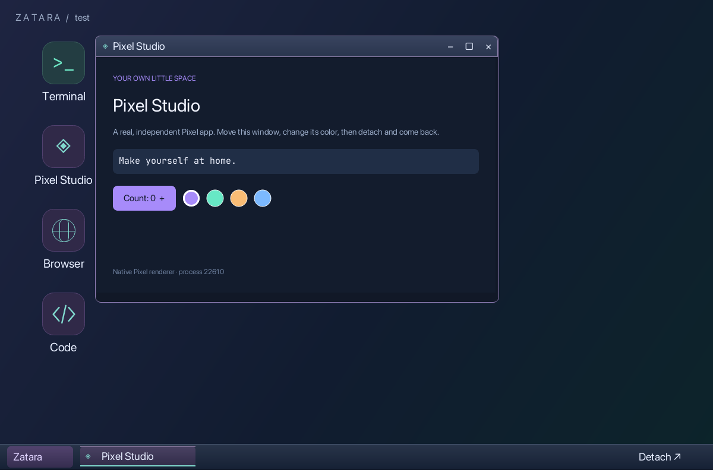

# Appearance configuration

Default location: `~/.config/zatara/config.json`, or
`$XDG_CONFIG_HOME/zatara/config.json` when XDG_CONFIG_HOME is set.
`ZATARA_CONFIG=/absolute/path/config.json` selects another file.

```sh
zatara config path    # print the resolved location
zatara config init    # create defaults; refuses to overwrite
zatara config check   # validate JSON and supported settings
```

These commands use the installed `zatara` executable. For source development,
run `node dist/cli.js` in its place from the built repository root.

For larger desktop icons and labels, independently of ordinary UI text:

```json
{
  "appearance": {
    "ui": { "fontSize": 16 },
    "desktop": {
      "fontSize": 14,
      "iconSize": 72,
      "iconTextSize": 20
    },
    "colors": { "accent": "#80d9ce" }
  }
}
```

Only specify settings you want to override. Missing settings use defaults.
Values are logical UI units at an 18-pixel terminal cell height. Zatara scales
all UI lengths by the reported terminal cell height divided by 18; for example,
34-pixel cells use about 1.89x. Fonts, icons, spacing and mouse targets grow
together. Guest surfaces remain native-resolution pixels. These settings are
independent of shell character columns.

| Setting | Default | Range / meaning |
| --- | ---: | --- |
| `ui.fontSize` | 13 | 10–20; title bars, taskbar, menus, tooltips, built-in managers |
| `desktop.fontSize` | 12 | 10–28; desktop session heading |
| `desktop.iconSize` | 48 | 24–112; icon plate width/height, glyph scales proportionally |
| `desktop.iconTextSize` | 12 | 10–28; desktop icon labels only |

Desktop icon spacing grows with icon and label sizes. Taskbar widths grow with
larger UI fonts and retain their overflow menu. Window control targets and title
bar/taskbar heights stay fixed; the supported UI font range fits those targets.
Shell text continues to follow terminal cell metrics. Browser/editor content and
third-party Pixel apps retain their own font settings. Pixel Studio is an example
independent guest and also retains its own application typography.

Optional `appearance.colors` overrides accept six-digit `#RRGGBB` values:

| Key | Default |
| --- | --- |
| `text` | `#e7eeff` |
| `muted` | `#9baac4` |
| `accent` | `#bba2f5` |
| `activeBorder` | `#9481ba` |
| `inactiveBorder` | `#45536b` |
| `desktopStart` | `#1e2441` |
| `desktopMiddle` | `#111c30` |
| `desktopEnd` | `#0c242a` |

This is a set of targeted overrides, not a complete skin format. Other panel and
control colors keep the built-in dark theme. Unknown keys, out-of-range numbers,
invalid colors, malformed JSON, or files larger than 64 KiB produce an error.

The desktop and built-in managers reload within about 750 ms, including atomic
editor saves. Invalid edits keep the last valid appearance and display an error;
fixing the file clears it. Removing the file restores defaults. File polling
does not repaint unchanged settings. No application process restarts on reload.
Configuration is per user/file, not stored inside individual sessions. When using
a custom ZATARA_CONFIG, launch the session service and attachment with the same
path so hosted manager apps read that file too.

Attachments running older code need one detach/reattach after upgrading to gain
reload support. Existing manager processes need reopening after that upgrade;
subsequent config edits reload normally. No session restart is required for the
desktop settings.

Validation covers independent overrides, invalid values, non-overwriting init,
atomic saves, last-good retention, file deletion, and live native desktop reload
with unchanged guest PID and reachable window controls. The larger configuration
below uses UI 18 px, heading 16 px, icon plates 72 px, and icon labels 20 px.


