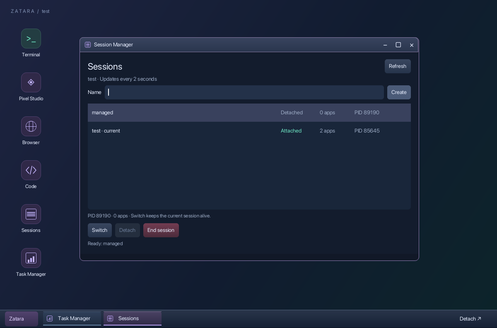
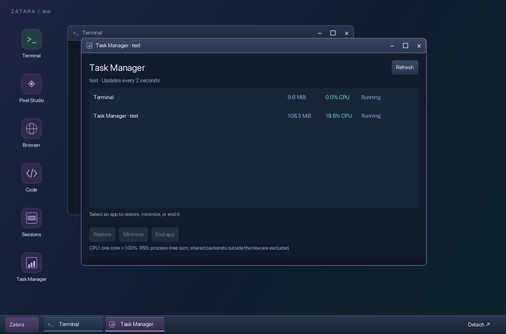

# Session and task management

Two app registrations, `sessions` and `tasks`, run separate native Pixel
processes through `src/manager.tsx`. They share presentation code and use the
same local session protocol as the CLI. Neither starts Chromium.

## Session lifecycle

`src/sessions.ts` shares session startup between CLI and GUI, retaining the
startup lock and detached service ownership. Discovery uses `.sock.pid`
sidecars, filters unreachable services, and limits each discovery batch to eight
concurrent connections. A session name ending in `-pixel` is valid and is no
longer mistaken for a guest socket. Session names retain the existing validation.

Create starts a detached, empty session. Switch first attaches a candidate
socket to the destination. Only after it receives a successful state does the
existing desktop adopt it and release the previous socket. The Pixel desktop
process and terminal rendering root are reused; apps remain in their original
services. Late packets from old sockets are ignored. Failed or occupied
destinations leave the original attachment intact and show an error.

The manager can detach any listed session. Ending a session requires an in-app
confirmation and rechecks its service PID, so a replacement session with the
same name is not accidentally terminated by an old confirmation. Ending the
manager's own session naturally ends the manager too. CLI `kill` remains an
explicit direct action without a second prompt.

## Task statistics

The service answers `tasks` with its authoritative window list and an async,
time-limited `ps` sample. Roots are live PTYs, live launchers, and connected
Pixel guest PIDs. Exited launchers are not used as roots. Descendant traversal
deduplicates overlapping roots within each app; unrelated OS processes are not
returned. Several simultaneous requests share one in-flight scan.

CPU is the delta of accumulated process CPU time divided by elapsed wall time;
the first sample is unavailable. RSS is summed process RSS, not private physical
memory. Exited short-lived descendants between samples are not accounted for.
Shared backend processes outside the tracked tree are excluded, and a process
shared by multiple windows can appear in each window's row. Do not add the rows
together as a unique whole-session memory total.

Task Manager exposes normal restore, minimize, and close operations by window
ID. It does not offer arbitrary PID killing or claim force-kill semantics for
uncooperative processes. Lifecycle ownership stays in the session service.

Both apps retain their selection and input state during detach. Auto-refresh
runs every two seconds while focused; it pauses when unfocused, minimized, or
detached. Lists scroll on smaller viewports and manager windows are resizable.

## Validation

The automated suite contains 10 tests, including these new checks:

- Parse process time and deduplicate overlapping process roots.
- Launch managers as independent processes and read real shell RSS/PIDs.
- Select and end a shell through Task Manager's native UI confirmation.
- Create, switch, and end a session through Session Manager's native UI.
- End a session containing a real shell and verify the shell exits.
- Kill/reconnect the desktop and retain manager PIDs and selected session.
- Switch there and back without changing the desktop or shell PID.
- Refuse an occupied destination while preserving the original attachment.
- Verify an unfocused Task Manager stops periodic frame production.

The existing PTY, graphics, input, output-flood, clipping/layout, and persistence
tests continue to run. This is native-host verification, not live Ghostty or
SSH validation. The prior physical-terminal acceptance limits still apply.

