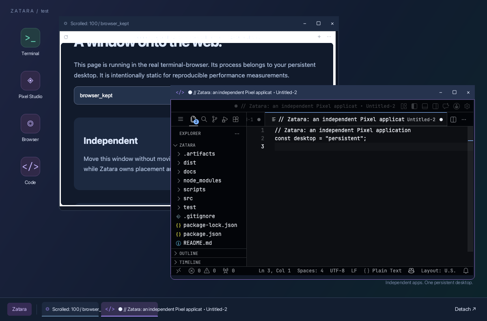

# Desktop polish plan

Review date: 2026-09-26. Implementation results are recorded in
[polish-results.md](polish-results.md). The review below preserves the rationale. Baseline: the committed proof of concept and its existing
measurements in [verification.md](verification.md).

## What the image tells us

The restrained indigo/teal background, clear desktop icons, and thin lavender
focus border establish a useful direction. Keep that palette and the quiet
desktop; improve legibility and window separation rather than adding effects.

- **Taskbar text escapes its buttons.** The editor document title runs well
  beyond its tile. Source inspection confirms labels request ellipsis but lack
  an explicitly constrained remaining width. Title bars have the same layout
  risk with long titles.
- **Browser toolbar text is visibly jagged.** Editor and desktop text look
  considerably cleaner. The image alone cannot establish whether this comes
  from the browser itself, guest scale negotiation, or surface compositing.
- **Window tops look square while bottom corners are rounded.** The title-bar
  fill needs consistent clipping or explicit corner treatment. Confirm Pixel's
  rounded clipping behavior before choosing the fix.
- **Foreground/background separation is weak.** Active and inactive headers
  differ only slightly; the active border helps, but overlap deserves a clearer
  hierarchy.
- **Controls and labels need consistency.** Window controls are tiny glyphs;
  app titles repeat document text already present in the editor. Desktop icon
  plates are coherent, but the browser glyph is not particularly recognizable.
- **The wallpaper caption competes with windows.** Its subtitle peeks out below
  the editor. Keep branding subtle enough that partially covered text does not
  attract attention.
- **The boottom taskbar has excessive padding and follows a flat style** A little 3D never hurt anyone.
- **The window top bar decoration should contain a border with a different color** Because the bottom window has a border that makes it protrude by 1 or 2 more pixels than the top. Also the background color of the window top decoration is same as color elsewhere so gets blended, the border will help differenciate that.
- **Shadows omitted** per the subsequent instruction to ignore shadows.

The browser page heading is cut off because this capture follows a deliberate
scroll test. That is not evidence of a clipping defect. This native frame also
does not prove how Ghostty presents the desktop at Retina scale.

## Pass 1 — Fit and clarity

1. Constrain title and taskbar labels to available space, reserving fixed space
   for icons and window controls. Use a stable app name in the taskbar; expose
   the document title in the window and a hover tooltip. Distinguish duplicate
   app instances with a short suffix. Provide an overflow menu when the taskbar
   cannot fit all entries; every minimized window must remain reachable.
2. Replace hard-coded taskbar right-click coordinate arithmetic with actual
   item bounds or item-level event handling supported by Pixel. Verify context
   menus at the left/right edges and after overflow or viewport changes.
3. Trace guest pixel dimensions, logical content dimensions, display scale,
   and surface presentation size. Compare a browser's raw guest frame with the
   desktop composite at 1:1 pixels. Correct any accidental resampling; if the
   jagged text originates upstream, document it and isolate a compatibility
   patch rather than blurring the whole desktop to hide it.
4. Make header clipping agree with the window's corner radius. Share geometry
   between decoration, clipping, content sizing, and input translation.
5. Capture fixed, unscrolled content for visual comparisons. Retain the existing
   scrolled/reconnected screenshot separately as functional evidence.

Primary files: `src/desktop.tsx`, `src/primitives.tsx`; inspect `src/server.ts`
and the pinned Pixel adapter only if scale tracing identifies a hosting issue.

## Pass 2 — A coherent visual language

1. Extract theme tokens for typography, spacing, radii, borders, and colors.
   Start with the current 36 px header and 58 px taskbar, then evaluate readable
   13–14 px UI labels at the target viewport and actual terminal scale.
2. Standardize minimize, maximize/restore, and close controls with consistent
   symbols and at least 32 × 32 px targets. Add distinct hover/pressed states,
   including a restrained red hover for close. Keep controls fixed while the
   title truncates.
3. Give the focused header a slightly clearer tonal separation and soften
   inactive decoration without dimming application content. Use borders and tonal contrast; omit shadows.
4. Improve browser/editor icon recognition while keeping the same icon plate
   sizes. Add clear desktop-icon selection feedback before double-click launch.
5. Reduce the wallpaper caption's prominence or remove the subtitle. Preserve
   the gradient and open desktop space.

Avoid continuous decorative animation and full-screen blur. Static polish must
retain repaint-on-change behavior.

## Pass 3 — Interaction finish

- Keep pointer feedback consistent on controls, title bars, and resize edges.
  Correct diagonal resize cursors: the current code uses `nwse-resize` for all
  corners, including northeast/southwest.
- Dismiss context menus predictably on outside click, Escape, launch, or action.
  Exercise right-click over guest content so it does not unintentionally open
  the desktop launcher as well as the application's own context menu.
- Check dragging/resizing at viewport boundaries and with very small terminals.
  Fit menus to their actual height and preserve reachable window controls.
- Give launching, unavailable, failed, and exited apps concise visible states.
  Retain process-preserving minimize and detach behavior.

## Validation and acceptance

For each pass, retain before/after captures at 1200 × 792 and add compact
(800 × 600) and large (1600 × 1000) viewports. Exercise short/long titles,
duplicate apps, many taskbar entries, active/inactive/minimized windows, menus,
and maximized windows. Check logical and physical pixel sizes separately for
1× and 2× scale; native captures cannot replace a live Ghostty inspection.

Add focused regressions for title/control overlap, taskbar overflow reachability,
and context-menu targeting. Re-run existing PTY, focus, output flood, and abrupt
reconnect tests; run the optional real-app suite after any guest-host changes.
Do not add snapshot assertions for every decorative constant.

Repeat native and transport benchmarks on the same machine and viewport with
matching app content. Take several samples after settling, report variability,
and compare CPU, RSS, frame timing, input-to-frame latency, and transmitted
bytes. Require no idle decorative repaint; investigate material regressions
before keeping visual effects. Preserve the distinction between frame callback
latency and actual display latency.

Live Ghostty/macOS and an authenticated SSH attachment remain acceptance work.
The polish pass must not describe either as verified until actually exercised.

Recommended sequence: ship Pass 1 first, review its real screenshots, then
apply Pass 2 and Pass 3 in small measured changes. Defer snapping, workspaces,
animations, and additional architectures until these fundamentals are sound.
