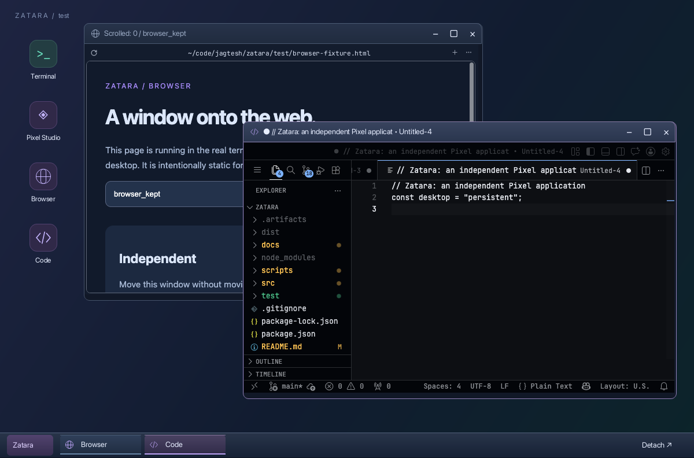
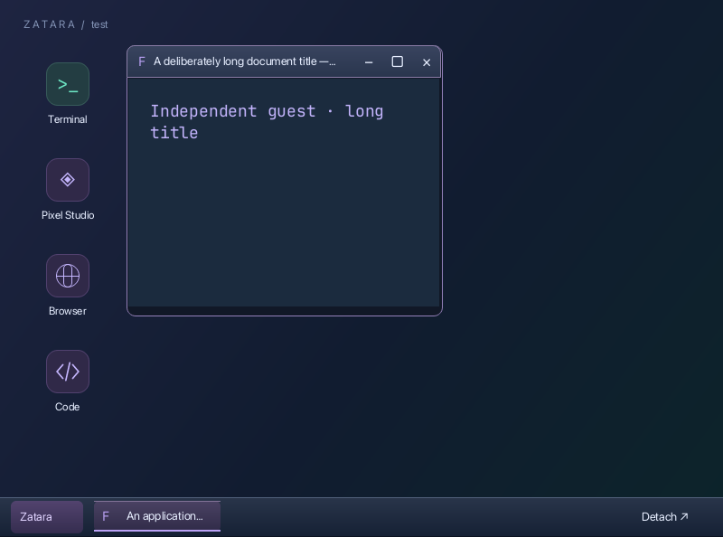
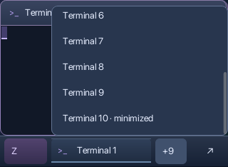

# Desktop polish results — 2026-09-26

Implemented the revised plan, with shadows omitted as subsequently requested.
The taskbar is now 44 px high (previously 58), with restrained gradients and
highlight borders. Window headers have their own border, rounded top corners,
clearer active/inactive tones, and fixed 32 px control targets. The wallpaper
caption is removed. Browser/editor icons now use native shapes; desktop icons
show selection and wrap into columns on shorter viewports.

## Layout and interaction

- Long window titles truncate before the controls. Taskbar entries use app names
  and duplicate-instance numbers; hovering exposes the document title.
- Taskbar rendering and right-click hit testing share geometry. Overflow offers
  all running windows, including minimized ones. Narrow desktops use compact
  launcher/detach controls. Long menus scroll and fit above the taskbar.
- Right-clicking guest content no longer opens the desktop launcher. Covered
  title bars cannot receive the foreground guest's context click.
- Menus dismiss on action, outside click, Escape, or launch. Paste is suppressed
  while a desktop menu is open. Northeast/southwest resize cursors are corrected.
- App launch, unavailable, failed, and exited states retain the existing error
  handling, with unavailable apps additionally identified in the launch menu.

## Browser text fix

The jagged toolbar was not a viewport-size mismatch. The browser exported a
680 × 432 BGRA frame into a 680 × 432 content surface. Comparing the guest image
with the desktop showed partially transparent text edges becoming overbright:
an example RGBA (210,225,240,17) became (255,255,255,17).

A small documented adapter composites straight-alpha guest pixels onto the
opaque window background before Surface upload. It mutates the attachment's
owned read buffer, leaving cached service frames and opaque pixels unchanged.
The real-app test checks a 610 × 22 toolbar region; all sampled RGB pixels now
match the expected composited frame exactly at the native 1:1 origin (147,77).
This fixes the alpha mismatch without filtering or rescaling the desktop.

## Validation

`npm test`: **7 passing tests**, including real PTYs, native Pixel guests,
independent shell state, focus isolation, 50,000 output lines, dragging/resizing,
maximize/restore, and abrupt reconnect with unchanged PIDs/state. New coverage
exercises taskbar-edge context targeting, overflow restoration, long-title
controls, alpha conversion, and scrolling to the last minimized app on a small
desktop. `npm run check` passes.

`npm run test:apps` passes with terminal-browser 0.11.1 and terminal-code 0.3.4:
typing, scrolling, editor text, minimize/restore, reconnect, and the toolbar
pixel comparison. Its separate final capture restores the browser to scroll
position zero; the original scroll/reconnect evidence remains separate.

Native captures were reviewed at requested sizes 800 × 600, 1200 × 792, and
1600 × 1000. Pixel rounds terminal height to whole cells, producing 800 × 594,
1200 × 792, and 1600 × 990 respectively. See the [compact capture](images/polish-compact.png)
and [large capture](images/polish-large.png).

A capture with `PIXEL_DISPLAY_SCALE=2` produced the same cell and surface sizes
as the 1× native-host run. This is **not Retina validation**. Live Ghostty,
terminal zoom, and authenticated SSH remain unverified, as before.

## Measurements

Three sequential native runs and three sequential inline-Kitty PTY transport
runs, on the same Apple M5 Pro/macOS arm64 host, Node 22.23.2, Pixel 0.0.15,
1200 × 792 viewport. The native workload is one shell plus Pixel Studio.
The upstream editor backend was stopped before these runs. Methods are unchanged
from [the original measurements](verification.md); full reports are preserved in
[polish-measurements.json](polish-measurements.json).

| Metric | Original exploratory run | Polished, range of three runs |
| --- | ---: | ---: |
| Initial idle RSS | 305 MiB | 306–308 MiB |
| Drag RSS | 318 MiB | 333–336 MiB |
| Drag CPU (one core = 100%) | 42.9% | 44.9–47.7% |
| Peak sampled RSS after shell output | 332 MiB | 348–350 MiB |
| Input-to-frame median | 24.9 ms | 23.6–24.3 ms |
| Input-to-frame p95 | 25.6 ms | 24.8–25.3 ms |
| Settled idle frames, 3 s | 0 | 0 |
| Idle encoded bytes, 2 s | 0 | 0 |
| Encoded drag bytes, 50 updates | 3.279 MB | 3.166–3.170 MB |

Each latency run has 10 samples. Both versions emit 48 captured frames during
the native drag workload; transport runs emit 20 frames. Initial idle samples
still include two settling frames; the later idle samples have none. Polished
settled idle CPU was about 0.66% of one core.

Latency remains close to baseline and static decoration introduces no ongoing
repaints. Memory after activity is about 16–18 MiB higher and measured drag CPU
is higher. This is a modest measured cost, not a claim of a performance win or
proof that a particular decoration caused the increase. No new process or
frame queue was introduced; guest conversion reuses the read buffer. A future
memory profile can separate renderer caches from application allocations.

The real-app smoke run observed about 2.67 GiB summed RSS, 20 processes, and no
idle desktop frames after restarting the shared editor backend. Treat its short
CPU/memory observation separately from the controlled native comparison. Earlier
repeats against a warm shared code-server accumulated extension hosts, so those
numbers are not an independent per-window memory baseline.

RSS sums can double-count shared pages. Input-to-frame ends at the native host
callback, not physical presentation. Transport counts actual encoded graphics
through a PTY with emulated capability replies; it does not measure SSH latency
or network backpressure. Browser scrolling is functionally exercised here;
this pass does not establish a sustained web-scrolling performance comparison.
